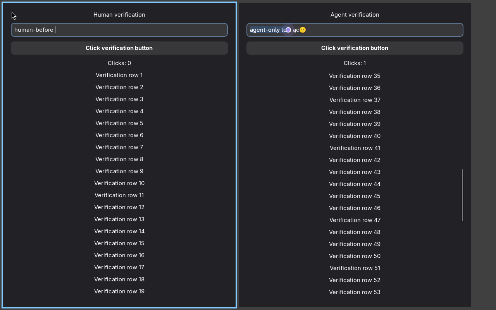

# niri-codex-computer-use

Let Codex work in a background window while you keep using your computer.

Our goal is computer use on **CachyOS and niri** with a visible agent cursor, independent input, and no interruption to your mouse or keyboard. Codex should be able to work with apps you have already opened: click, type, scroll, drag, and take window screenshots without switching your active window or workspace. The target does not require separate agent displays or changes to how you launch your apps.

## What we want to get right

- **Your cursor stays yours.** Agent input must not move your pointer or change its shape.
- **You keep your focus.** Typing and clicking in another app must not interrupt your work.
- **You can see the agent.** A separate cursor uses your cursor theme with a random agent color. The color stays consistent while that agent works.
- **Background windows stay in the background.** The agent can work in covered or off-screen windows without bringing them forward.
- **Updates preserve a working setup.** Compatibility checks should reject a broken update and leave the previous version available for rollback.

If background input is unavailable, we should report that clearly. Quietly taking over your mouse or keyboard is not an acceptable fallback.

## Current status

This is an early project. Our niri 26.04 build and Codex backend pass isolated GTK tests on CachyOS for clicks, text including Unicode, keys, scroll, drag, and screenshots on another workspace. The human test app keeps its input, pointer position, focus, and clipboard. The updated agent cursor reuses the human cursor image with a separate tint.

The current Codex SDK checks and two successive update-source snapshots also pass. We have built separate CachyOS packages. A first-login launcher bug was found and fixed. The updated companion session now passes GTK tests through the actual `cua_repl` tool: Unicode text, indexed clicks, scrolling, dragging, keyboard shortcuts, and fresh window images at 150% scale. Input and fresh images also work on an inactive workspace. Chromium previously passed image-based control with no accessible controls. Concurrent input to two XWayland apps remains unsupported because they share one Wayland client. This is not ready to promise compatibility with every application. An earlier real session ended in a compositor crash. Its cause is still under investigation, so long-term stability is not yet established.

Existing X11 windows are also tested without accessibility. Clicking, ASCII text, dragging, and hidden-window images pass. Non-ASCII text is safely refused, and an initial scroll still fails. The X11 suite reports these gaps as failures.

The project stores patches and source pins, not a copy of niri. Source builds fetch the reviewed upstream revision into an ignored build directory. GitHub release updates and a Topgrade drop-in are provided. No stable release is published yet, so the updater leaves the installed version alone.

See [installation](docs/installation.md) for build, test, activation, and rollback steps. See [maintenance](docs/maintenance-cachyos.md) for updates and [native API compatibility](docs/native-api-compatibility.md) for the tested contract. The original NixOS files remain as reference material.

## How it works

The patches give niri a way to send input directly to a chosen app and capture that window without activating it. The Codex backend uses those requests instead of moving the desktop pointer. Niri draws an agent cursor in the target window.

This requires a patched niri compositor. It is not a setting you can turn on in stock niri or Codex. See [background control](docs/background-control.md) for the limits and the checks we require.

## Contributing

**PRs are welcome.** Help with CachyOS packaging, Codex compatibility, tests, documentation, and real app testing is useful.

Read [CONTRIBUTING.md](CONTRIBUTING.md) before making changes. For a bug report or PR, include your niri and Codex versions, what you tested, and whether the agent changed your cursor, focus, or clipboard. Keep changes small enough to review.

## Credits and license

Based on [lihaoze123/niri-computer-use](https://github.com/lihaoze123/niri-computer-use), with the original work credited to chumeng. It extends [niri](https://github.com/niri-wm/niri) and the backend from [ilysenko/codex-desktop-linux](https://github.com/ilysenko/codex-desktop-linux). We preserve their history and notices.

Integration code is [MIT](LICENSE). Niri changes are [GPL-3.0-or-later](LICENSES/GPL-3.0-or-later.txt). Codex is OpenAI software and is not included here. This is an independent community project.
